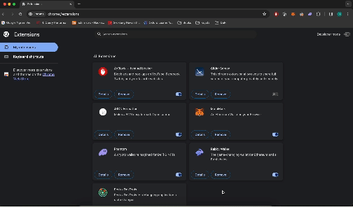
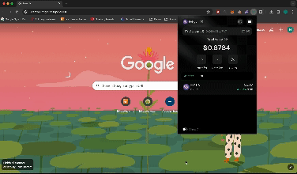
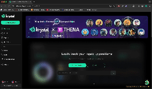

# NFT-Wallet-Extension

# Get started

Requirements:
- Node 16

Install dependencies:
```
$ yarn
```

Build extension
```
$ yarn build
```

After this step, a folder `build` is generated. To add this to Chrome extension locally, first enable developer mode and load the `build` folder




Build for development
```
$ yarn start
```
Then import folder `dev` instead of `build`

# Functionalities
1. Create smart account



2. Interact with dapps, make transactions


